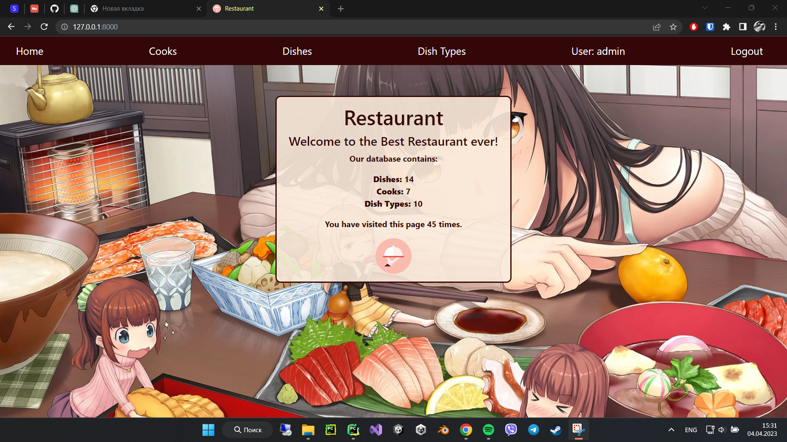

# Restaurant Project
Django Project for managing Cooks, Dishes & Dish Types

# Check it out!
[Restaurant Kitchen project deployed to render](https://restaurant-service-lpuy.onrender.com)

## Installation
Python3 must be already installed

```shell
git clone https://github.com/yhwh6/restaurant_service.git
cd restaurant_service
python3 -m venv venv
source venv/bin/activate
pip install -r requirements 
rename .env.sample => .env and place your django key into this file
python manage.py runserver
```

## Features
Authentication for Cook/User
Managing Cooks, Dishes & Dish Types directly from the website
Powerful admin panel for advanced managing

## Demo

```shell
username: Guest
password: iNDx98EvAszYtmQ
```

